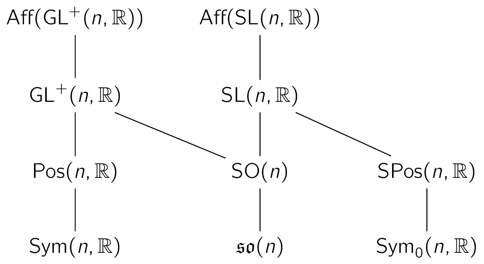

<h1 align="center">
  <br>
    Lie Group Decompositions for Equivariant Neural Networks (ICLR 2024)
  <br>
</h1>

<h4 align="center">
Implementation of <a href="https://arxiv.org/abs/2310.11366" target="_blank">"Lie Group Decompositions for Equivariant Neural Networks"</a></h4>
<h6 align="center">Mircea Mironenco, Patrick Forré</h6>

<p align="center">
  <a href="#overview">Overview</a> •
  <a href="#installation">Installation</a> •
  <a href="#experiments">Experiments</a> •
  <a href="#citation">Citation</a>
</p>

# Overview

<p align="center" width="60%">

</p>   

# Installation

Assuming [torch (>= 2.0) and torchvision](https://pytorch.org/get-started/locally/) are installed & configured, simply run:

```shell
git clone https://github.com/mirceamironenco/rgenn.git
cd rgenn
pip install -r requirements.txt
```
To reproduce the main experiments, the minimal requirements are `scipy einops tqdm`.

# Experiments

To reproduce the [affNIST](http://www.cs.toronto.edu/tijmen/affNIST) results from Section 5, for the $\mathbb{R}^{2} \rtimes \mathrm{SL}(2, \mathbb{R})$ group:
```shell
python train.py --amp --liegroup=sl2 --gsamples=10
```
Alternatively, setting `--liegroup=gl2` will reproduce our results for the $\mathbb{R}^{2} \rtimes \mathrm{GL}^{+}(2, \mathbb{R})$ (full affine) group.

If multiple GPUs are available, training with [DDP](https://pytorch.org/docs/stable/notes/ddp.html) has been configured for single-node use:
```shell
torchrun --nnodes=1 --nproc_per_node=gpu train.py --amp --liegroup=sl2 --gsamples=10
```

# Citation
```
@inproceedings{
mironenco2024lie,
title={Lie Group Decompositions for Equivariant Neural Networks},
author={Mircea Mironenco and Patrick Forr{\'e}},
booktitle={The Twelfth International Conference on Learning Representations},
year={2024},
url={https://openreview.net/forum?id=p34fRKp8qA}
}
```